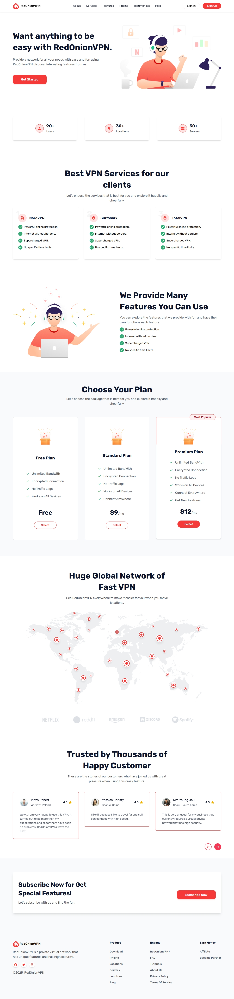

# RedOnionVPN

## Project Overview :
This project is a simple landing page for a VPN service. It is built with using Tailwind CSS and AOS library for animations.

## Technologies Used :
- `HTML5`
- `Tailwind CSS V4.1`
- `JavaScript`
- `AOS on scroll animation library`
- `Swiper.Js Slider Library`
- `Fontawesome Icon`
- `Google Fonts`

## Features :
- Mobile Friendly Responsive Design
- Smooth Scrolling Animation
- Easy To Customize

## Installation :
1. Clone the repositories
2. Install the dependencies
3. Run the development server

## Contributing :
1. Fork the repository
2. Create a new branch
3. Make your changes and commit them
4. Push your changes to your fork
5. Create a pull request

## Project Design At A Glance :
